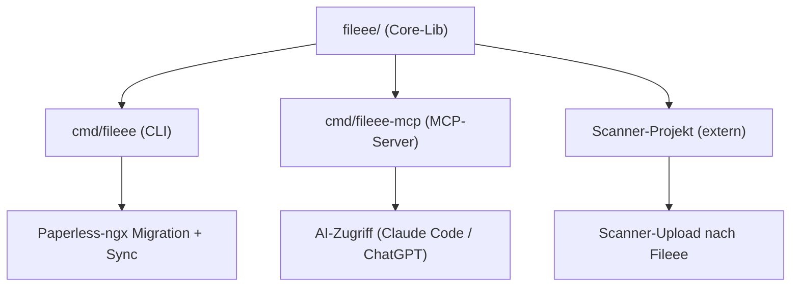

# go-fileee

Eine **inoffizielle** Go-Client-Library für das **interne** Web-App-API von [Fileee](https://www.fileee.com) (`my.fileee.com`). Fileee bietet kein öffentliches API — diese Library kapselt das Protokoll, das die eigene Web-App verwendet, rekonstruiert aus mitgeschnittenem Netzwerk-Traffic eines eingeloggten eigenen Kontos.

> **Status:** In Entwicklung — privat. Noch keine stabile Version, kein `v0`-Tag, API kann sich jederzeit ändern.

## Warum

`go-fileee` ist der Kern-Baustein für die Migration von Fileee zu [Paperless-ngx](https://docs.paperless-ngx.com/) und für weitergehende Automatisierung rund um archivierte Dokumente. Statt Dokumente manuell zu exportieren, kapselt die Library Login (inkl. TOTP-2FA), Dokument-Sync, Download und Upload programmatisch.

## Die drei Konsumenten



| Modul | Zweck |
|-------|-------|
| **A: Core-Lib** (`fileee/`) | Auth (Session-Cookie + TOTP), Entities, Download, Upload. Zustandslos — der Aufrufer hält den Sync-Cursor. |
| **B: CLI** (`cmd/fileee`) | Export → dauerhaftes Disk-Archiv → Migration nach Paperless-ngx + inkrementeller Sync. Paperless-spezifisches Wissen lebt **ausschließlich** hier (`internal/paperless`), nie in der Core-Lib. |
| **C: MCP-Server** (`cmd/fileee-mcp`) | Stellt Fileee-Inhalte für AI-Tools (Claude Code, ChatGPT, …) bereit. Da es sich um private Finanzdokumente handelt: **read-only als Default**, Transport/Auth bewusst gewählt. |
| **Extern: Scanner-Projekt** | Nutzt die Core-Lib zum direkten Upload gescannter Dokumente nach Fileee. |

## Geplante Modulstruktur

```
go-fileee/
├── fileee/              # Core-Lib: Auth, Entities, Client
│   ├── auth.go          # Session-Cookie-Login + TOTP
│   ├── documents.go      # Dokumente: query/diff/get/put/upload
│   ├── companies.go      # Firmen (→ Paperless Correspondents)
│   ├── contacts.go        # Kontakte (CRUD)
│   ├── tags.go            # Tags (→ Paperless Tags)
│   ├── documenttypes.go   # Dokumenttypen (→ Paperless Document-Types)
│   └── client.go          # HTTP-Client, Cookie-Jar, CSRF-Handling
├── cmd/
│   ├── fileee/            # CLI: Export, Migration, Sync
│   └── fileee-mcp/        # MCP-Server für AI-Zugriff
├── internal/
│   └── paperless/         # Paperless-ngx-spezifisches Mapping (nur CLI)
├── docs/
│   ├── API.md              # Fileee-API-Referenz (secret-safe, aus HAR rekonstruiert)
│   └── adr/                # Architecture Decision Records
└── fixtures/               # HAR-abgeleitete Test-Fixtures (keine echten Secrets)
```

## Auth-Modell (Kurzfassung)

Fileee hat **kein** Bearer-/Refresh-Token-API. Die Session lebt in einem httpOnly-Cookie plus CSRF-Header (`x-xsrf-token`, Double-Submit-Cookie). 2FA läuft über TOTP und wird **im selben Login-Request** mitgeschickt — dadurch ist ein vollständig headless-Betrieb möglich, solange der TOTP-Seed bekannt ist.

```
GET  /api/f/start                        → Session/CSRF-Cookie initialisieren
POST /api/f/existent   {username}        → Konto- + 2FA-Check
POST /api/f/login      {user,pw,totp}    → setzt Session-Cookie
GET  /api/f/user-session                 → authorized:true zur Kontrolle
```

Details: [`docs/API.md`](docs/API.md) Abschnitt 2, sowie [ADR-0002](docs/adr/0002-auth-modell-session-cookie-totp.md).

## Sicherheit

- **Credentials** (Username, Passwort, TOTP-Seed) gehören **ausschließlich** in einen Secret-Manager (Vaultwarden/Infisical) — niemals in Code, Fixtures oder Commits.
- Die **Session-Cookie-Jar** ist ein Secret (Dateirechte `0600`), wird nie geloggt oder committed.
- Dokument-Inhalte und -Metadaten sind **PII** — Test-Fixtures enthalten ausschließlich synthetische oder bewusst anonymisierte Daten.
- Die Library **schont Fileees Infrastruktur bewusst**: ein eingebauter Rate-Limiter (konservativer Default) plus Exponential-Backoff mit Jitter im HTTP-Transport begrenzen die Request-Frequenz für alle Konsumenten, Delta-Sync (`/diff`) statt Voll-Reloads reduziert die Last, und Konto-Sperren (`secondsBlocked`) werden respektiert. Details: [ADR-0005](docs/adr/0005-schonender-betrieb-rate-limiting.md).
- Siehe [`docs/API.md`](docs/API.md) Abschnitt 6 für die vollständigen Secret-Hinweise.

## Disclaimer

Dies ist **kein offizielles Fileee-API** — es handelt sich um eine Rekonstruktion des internen Protokolls der Web-App `my.fileee.com`, gewonnen aus dem Netzwerkverkehr eines eigenen, eingeloggten Kontos. Konsequenzen:

- Fileee kann das interne API **jederzeit ohne Ankündigung ändern** — diese Library kann dadurch brechen.
- Die Nutzung ist **ausschließlich für das eigene Fileee-Konto** vorgesehen, nicht für fremde Konten oder Massenzugriffe.
- Es gibt **keine Gewähr** für Vollständigkeit, Korrektheit oder Dauerhaftigkeit der Funktionalität.
- Nutzer sind selbst dafür verantwortlich, die Nutzungsbedingungen von Fileee einzuhalten.

## Dokumentation

- [`docs/API.md`](docs/API.md) — vollständige API-Referenz (Endpunkte, Auth-Ablauf, Datenmodell-Mapping nach Paperless-ngx)
- [`docs/adr/`](docs/adr/) — Architecture Decision Records (Grundsatzentscheidungen zu Architektur, Auth, Risiko, Tests)

## Lizenz

[MIT](LICENSE) — Copyright © 2026 Björn Strausmann
