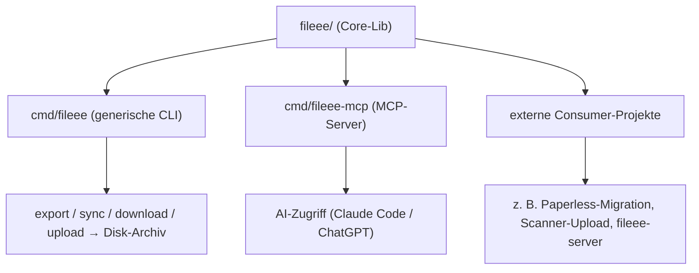

# go-fileee

[](https://github.com/strausmann/go-fileee/actions/workflows/test.yml)
[](https://pkg.go.dev/github.com/strausmann/go-fileee/fileee)
[](https://goreportcard.com/report/github.com/strausmann/go-fileee)
[](go.mod)
[](LICENSE)

Eine **inoffizielle** Go-Client-Library für das **interne** Web-App-API von [Fileee](https://www.fileee.com) (`my.fileee.com`). Fileee bietet kein öffentliches API — diese Library kapselt das Protokoll, das die eigene Web-App verwendet, rekonstruiert aus mitgeschnittenem Netzwerk-Traffic eines eingeloggten eigenen Kontos.

> **Status:** Öffentliches Repository, aktueller Release-Tag `v0.1.1`. Reverse-engineertes internes API — **keine Stabilitätsgarantie**, Endpunkte/Feldformate können sich jederzeit ändern.

## Über Fileee

[Fileee](https://www.fileee.com) ist ein Dokumentenmanagement-Dienst der fileee GmbH (Deutschland),
der Papierkram digitalisiert und automatisch ordnet. Belege werden per App gescannt oder importiert;
eine Texterkennung (OCR) erkennt Dokumenttyp, Absender, Datum und Fristen automatisch, sodass sich
alles per Volltext durchsuchen lässt. Dazu kommen Fristen-Erinnerungen, Teilen über „fileee Spaces"
(inkl. Bearbeitungsschutz) sowie Export- und Direkt-Integrationen (u. a. DATEV, lexoffice, SevDesk).

Datenschutz ist ein Kernversprechen: **Hosting in Deutschland, DSGVO-konform**, Dokumente werden
**individuell verschlüsselt** gespeichert, Zwei-Faktor-Authentifizierung ist verfügbar.

Ergänzt wird der Dienst durch die **fileeeBox** — eine physische Ablagebox mit individuellem
Barcode: Dokumente werden gescannt und einfach oben in die Box gelegt; die App merkt sich Box und
Position. Über die Box eingescannte Seiten (bis zu 600) belasten das monatliche Upload-Kontingent
nicht. Als günstige Selbstbau-Variante gibt es **fileeeDIY** (Druckvorlagen für Schuhkarton/Ordner).

*Diese Library ist ein inoffizielles, unabhängiges Community-Projekt und steht in keiner Verbindung
zur fileee GmbH.*

## Installation

```bash
go get github.com/strausmann/go-fileee/fileee@v0.1.1
```

Voraussetzung: **Go 1.25** oder neuer (siehe `go.mod`).

## Quickstart

### Lesen: Volltextsuche + Dokument laden

```go
package main

import (
	"context"
	"fmt"
	"log"
	"os"

	"github.com/strausmann/go-fileee/fileee"
)

func main() {
	// Credentials aus einer Secret-Quelle laden, nie hartkodieren.
	client, err := fileee.New(fileee.Credentials{
		Username: os.Getenv("FILEEE_USERNAME"),
		Password: os.Getenv("FILEEE_PASSWORD"),
		TOTPSeed: os.Getenv("FILEEE_TOTP_SEED"), // Base32-Seed, leer wenn kein Zwei-Faktor aktiv ist
	})
	if err != nil {
		log.Fatal(err)
	}

	ctx := context.Background()
	if err := client.EnsureSession(ctx); err != nil {
		log.Fatal(err)
	}

	// Volltextsuche -> Dokument-IDs, dann Details laden.
	res, err := client.Documents.Search(ctx, "Rechnung", fileee.SearchOptions{Limit: 20})
	if err != nil {
		log.Fatal(err)
	}
	for _, id := range res.IDs {
		doc, err := client.Documents.Get(ctx, id)
		if err != nil {
			log.Fatal(err)
		}
		fmt.Println(doc.ID)
	}
}
```

### Schreiben: Erinnerung an ein Dokument anlegen

```go
r, err := client.Reminders.Create(ctx, &fileee.Reminder{
	Description: "Widerspruchsfrist",
	DocumentID:  doc.ID,
	StartDate:   "2026-08-15", // YYYY-MM-DD
})
if err != nil {
	log.Fatal(err)
}
fmt.Println("angelegt:", r.ID)
```

Alle mutierenden Aufrufe (Create/Update/Upload/Delete/Share/…) laufen über denselben `Client` und
brauchen keine zusätzliche Konfiguration — CSRF-Header und Session-Handling übernimmt die Lib.

Weitere Konfiguration über die `With…`-Optionen von `New` (siehe [Client-Optionen](#client-optionen)
unten). Vollständige Referenz aller Typen und Methoden:
[pkg.go.dev](https://pkg.go.dev/github.com/strausmann/go-fileee/fileee) bzw. `go doc ./fileee`.

## Auth-Modell

Fileee hat **kein** Bearer-/Refresh-Token-API. Die Session lebt in einem **httpOnly-Cookie**, das
serverseitig gesetzt wird. Für alle mutierenden Requests (POST/PUT/DELETE) wird zusätzlich ein
**CSRF-Header** `x-xsrf-token` gesetzt (Double-Submit-Cookie: Wert kommt aus dem `XSRF-TOKEN`-Cookie).
2FA läuft über TOTP (RFC 6238) und wird **im selben Login-Request** mitgeschickt — es gibt keinen
zweiten Schritt, dadurch ist vollständig headless Betrieb möglich, solange der TOTP-Seed bekannt ist.

```
GET  /api/f/start                        → Session/CSRF-Cookie initialisieren
POST /api/f/existent   {username}        → Konto- + 2FA-Check
POST /api/f/login      {user,pw,totp}    → setzt Session-Cookie
GET  /api/f/user-session                 → authorized:true zur Kontrolle
```

**Automatischer Re-Auth:** Läuft ein Request in HTTP 403, löst der Client automatisch genau einen
Re-Auth-Versuch aus (zuerst per `rememberMe`-Cookie, sonst voller Passwort/TOTP-Login) und
wiederholt danach den Original-Request. Parallele Requests, die im selben abgelaufenen
Session-Fenster auf 403 laufen, teilen sich diesen einen Re-Auth (kein Stampede). Über
`WithSessionFreshness(d)` lässt sich zusätzlich ein Zeitfenster definieren, innerhalb dessen
`EnsureSession` den Session-Check-Roundtrip überspringt — sinnvoll für langlaufende Konsumenten
zusammen mit `StartKeepAlive`.

**XSRF-Cookie-Scope (Eigenheit des Fileee-Servers):** Das `XSRF-TOKEN`-Cookie wird **ohne**
explizites `Path`-Attribut gesetzt. Nach RFC 6265 §5.1.4 leitet ein `http.CookieJar` den Cookie-Pfad
dann vom Request-Pfad ab — für `/api/f/login` & Co. ist das `/api/f`, **nicht** `/`. Die Lib fragt
den Jar deshalb konsequent unter `<baseURL>/api/f/` ab, statt unter der reinen Basis-URL — sonst
bliebe `x-xsrf-token` bei jedem mutierenden Request leer. Das ist als Implementierungsdetail nur
relevant, wenn eigener Code direkt mit dem `http.CookieJar` des `*http.Client` arbeitet.

Details: [`docs/API.md`](docs/API.md) Abschnitt 2, sowie [ADR-0002](docs/adr/0002-auth-modell-session-cookie-totp.md).

## Feature-Übersicht

Vollständige Methodenliste aller Services. `Mutation?` markiert Requests, die auf dem Fileee-Server
Zustand ändern (POST/PUT/DELETE) — bei diesen greifen Rate-Limit/Backoff genauso wie bei Lesezugriffen,
aber sie sind nicht idempotent wiederholbar wie ein einfaches `GET`.

### Client-Ebene (nicht Service-gebunden)

| Methode | Beschreibung | Mutation? |
|---|---|---|
| `fileee.New(creds, opts...)` | Konstruktor, kein sofortiger Login | – |
| `Client.Login(ctx)` | Voller Passwort/TOTP-Login | Ja (Session) |
| `Client.Logout(ctx)` | Serverseitiger Widerruf + lokaler Jar-Clear | Ja (Session) |
| `Client.EnsureSession(ctx)` | Session sicherstellen, bei Bedarf automatisch reauthentifizieren | ggf. (Re-Auth) |
| `Client.AccountStatus(ctx)` | Abo-/Lizenz-Info | Nein |
| `Client.UserID(ctx)` | Eigene User-ID (aus Cookie oder JWT-Claim) | Nein |
| `Client.RefreshSession(ctx)` | Erzwungene Session-Verifikation (ignoriert das Freshness-Fenster) | Ja (Session) |
| `Client.StartKeepAlive(ctx, interval)` | Periodischer Session-Refresh im Hintergrund, liefert `stop()` | Ja (Hintergrund) |
| `Client.WaitForProcess(ctx, id, opts)` | Pollt `Processes.Get` bis ein Vorgang terminal ist | Nein (Poll) |

### `Client.Documents` (`*DocumentService`)

| Methode | Beschreibung | Mutation? |
|---|---|---|
| `Query(ctx, opts)` | Paginierte Liste | Nein |
| `Diff(ctx, cursor)` | Inkrementeller Sync (bevorzugt gegenüber `Query`) | Nein |
| `Get(ctx, id)` | Einzelabruf | Nein |
| `Update(ctx, doc)` | Metadaten ändern, Optimistic Locking über `Version` | Ja (PUT) |
| `Delete(ctx, id)` | **Hard-DELETE, unwiderruflich** (siehe [unten](#destruktive-methoden)) | Ja |
| `Upload(ctx, r, meta)` | Multipart-Upload mit client-generierter ID, Server erkennt Duplikate | Ja (POST) |
| `DownloadPDF(ctx, id, mode)` | Original-PDF als Stream | Nein |
| `DownloadPageImage(ctx, pageID, size, version)` | Seiten-Bild-Fallback als Stream | Nein |
| `Share(ctx, documentIDs)` | Freigabe-Link erzeugen | Ja (POST) |
| `Unshare(ctx, documentID)` | Freigabe aufheben | Ja (POST) |
| `ExportZIP(ctx, documentIDs, password)` | Passwortgeschützter ZIP-Export einer Teilmenge (async) | Ja (POST) |
| `ExportAll(ctx, password)` | ZIP-Export aller Dokumente (async) | Ja (POST) |
| `PageOCR(ctx, pageID)` | OCR-Tokens (Text + Bounding-Box) einer eigenen Seite | Nein |
| `Conversations(ctx, documentID)` | Konversationen, in denen das Dokument geteilt ist | Nein |
| `Search(ctx, term, opts)` | Volltextsuche (FULLTEXT/FUZZY), liefert nur IDs | Nein |

### Stammdaten (read-only): `Tags`, `Companies`, `DocumentTypes`, `DocumentTypeSchemes`

| Service (Feld) | Methoden | Beschreibung | Mutation? |
|---|---|---|---|
| `Tags` | `Query` / `Diff` / `Get` | Dokument-Tags | Nein |
| `Companies` | `Query` / `Diff` / `Get` | Firmen/Absender | Nein |
| `DocumentTypes` | `Query` / `Diff` / `Get` | Dokumenttypen (`Diff` fällt bei 404/405 automatisch auf `Query` zurück) | Nein |
| `DocumentTypeSchemes` | `Query` / `Diff` / `Get`, `Fields()` auf dem Typ | Feldschema je Dokumenttyp | Nein |

### `Client.Contacts` (`WriteService[Contact]`)

| Methode | Beschreibung | Mutation? |
|---|---|---|
| `Query(ctx, opts)` / `Diff(ctx, cursor)` / `Get(ctx, id)` | Lesen | Nein |
| `Create(ctx, contact)` | Neuen Kontakt anlegen | Ja (POST) |
| `Update(ctx, contact)` | Kontakt ändern | Ja (PUT) |
| `Delete(ctx, id)` | **Hard-DELETE, unwiderruflich** (siehe [unten](#destruktive-methoden)) | Ja |

### `Client.Reminders` (`ReminderService`)

| Methode | Beschreibung | Mutation? |
|---|---|---|
| `Query(ctx, opts)` / `Diff(ctx, cursor)` / `Get(ctx, id)` | Lesen | Nein |
| `Create(ctx, reminder)` | Neue Erinnerung anlegen (an ein `DocumentID` gebunden) | Ja (POST) |
| `Update(ctx, reminder)` | Erinnerung ändern | Ja (PUT) |
| `Delete(ctx, id)` | **Hard-DELETE, unwiderruflich** (siehe [unten](#destruktive-methoden)) | Ja |

### `Client.Boxes` (`BoxService`)

| Methode | Beschreibung | Mutation? |
|---|---|---|
| `List(ctx)` | Alle FileeeBoxen (intern ein Diff mit vollem Cursor) | Nein |
| `Get(ctx, id)` | Einzelne Box | Nein |
| `AddDocument(ctx, boxID, documentID)` | Dokument einer Box zuordnen | Ja (POST) |
| `RemoveDocument(ctx, boxID, documentID)` | Zuordnung aufheben (keine Dokument-Löschung) | Ja (DELETE) |

### `Client.Processes` (`ProcessService`)

| Methode | Beschreibung | Mutation? |
|---|---|---|
| `Get(ctx, id)` | Status eines asynchronen Vorgangs (z. B. ZIP-Export) abfragen | Nein |

### `Client.Conversations` (`ConversationService`)

| Methode | Beschreibung | Mutation? |
|---|---|---|
| `Query(ctx, opts)` / `Diff(ctx, cursor)` / `Get(ctx, id)` | Lesen | Nein |
| `SendMessage(ctx, conversationID, text)` | Chat-Nachricht senden | Ja (POST) |
| `ShareDocument(ctx, conversationID, documentID)` | Dokument in die Konversation teilen | Ja (POST) |
| `UnshareDocument(ctx, conversationID, documentID)` | Dokument aus der Konversation entfernen (keine Dokument-Löschung) | Ja (POST) |
| `AddParticipant(ctx, conversationID, email, role)` | Teilnehmer einladen | Ja (POST) |
| `RemoveParticipant(ctx, conversationID, participantID)` | Teilnehmer entfernen | Ja (DELETE) |
| `PendingInvitations(ctx)` | Offene Einladungen an das eigene Konto | Nein |
| `AcceptInvitation(ctx, invitationToken)` | Einladung annehmen | Ja (POST) |

### `ShareClient` (anonym, ohne Login)

Eigener Konstruktor `fileee.NewShareClient(opts...)` — für Empfänger eines Freigabe-Links, z. B.
N8N-Webhook-Flows. Nutzt dieselben `With…`-Optionen wie `New`, aber keine `Credentials`.

| Methode | Beschreibung | Mutation? |
|---|---|---|
| `Resolve(ctx, token)` | Freigabe-Objekt zum Token auflösen | Nein |
| `DownloadPageImage(ctx, token, pageID, size)` | Seitenbild aus einer Freigabe laden | Nein |
| `DownloadSharedPage(ctx, pageID, shareID, sharedByID)` | Roher Seiten-Stream | Nein |
| `DownloadSharedPDF(ctx, shareID, documentID, mode)` | Voll-PDF vom Static-Host laden | Nein |
| `SharedPageOCR(ctx, pageID, shareID, sharedByID)` | OCR-Tokens einer freigegebenen Seite | Nein |

### Paket-Funktionen ohne Service-Bindung

| Funktion | Beschreibung |
|---|---|
| `ParseDocumentLink(link) (LinkKind, string)` | Erkennt, ob ein Link intern (`…/documents/:id`) oder eine Freigabe (`…/shared/:token`) ist |
| `ShareTokenFromLink(link) string` | Extrahiert den Freigabe-Token aus einem Freigabe-Link |

## Destruktive Methoden

`Documents.Delete`, `Contacts.Delete` und `Reminders.Delete` sind **echte, serverseitige
Hard-DELETEs ohne Papierkorb** — einmal ausgeführt, ist die Löschung nicht rückgängig zu machen. Es
gibt **keinen serverseitigen Bestätigungsschritt**: Die Methoden sind aufrufbar, sobald ein `Client`
existiert. Der „Guard" ist ein reines Design-Prinzip — die Lib bietet sie bewusst als **Opt-in** an
(kein automatischer/impliziter Aufrufpfad); wer sie nutzt, muss selbst dafür sorgen, dass sie nicht
versehentlich ausgelöst werden (z. B. über einen expliziten Bestätigungsschritt im eigenen Code).
Bei fehlender Entität liefern sie `ErrNotFound` (per `errors.Is` prüfbar), sonst einen `*APIError`.

**Bewusst NICHT implementiert:** `revision-lock` (`POST /api/documents/rest/:id/revision-lock`) —
in einer Live-Verifikation hat dieser Aufruf ein Dokument in einen nicht mehr serialisierbaren
Zustand versetzt (`GET`/`Diff`/`Query` lieferten danach 500). Details und Hintergrund:
[ADR-0007](docs/adr/0007-ausschluss-destruktiver-operationen.md).

## Client-Optionen

| Option | Beschreibung | Default |
|---|---|---|
| `WithBaseURL(url)` | Basis-URL des API-Hosts überschreiben | `https://my.fileee.com` |
| `WithStaticBaseURL(url)` | Static-Host für `ShareClient`-Voll-PDFs überschreiben | `https://static.fileee.com` |
| `WithHTTPClient(hc)` | Eigenen `*http.Client` (Timeout/Transport) übernehmen — die Lib mischt sich dann nicht ein | geklonter `http.DefaultTransport` mit `ResponseHeaderTimeout=30s` |
| `WithSessionStore(s)` | Persistenz-Store für den Session-Cookie-Jar | Datei im Nutzerprofil (`0600`) |
| `WithSessionFreshness(d)` | Zeitfenster, in dem `EnsureSession` den Session-Check-Roundtrip überspringt | `0` (aus, jeder Aufruf verifiziert) |
| `WithRateLimit(rps, burst)` | Token-Bucket für ausgehende Requests | `1` req/s, Burst `3` |
| `WithBackoff(policy)` | Retry-Strategie bei 429/5xx und Netzwerkfehlern | `NewExponentialBackoff()` — 200ms Basis, 5s Deckel, max. 5 Versuche, Jitter |
| `WithLogger(l)` | `*slog.Logger` der Lib | verwirft alle Ausgaben |
| `WithUserAgent(ua)` | Eigenen Konsumenten-User-Agent voranstellen (Lib-Kennung `go-fileee/<version>` wird immer angehängt) | nur `go-fileee/<version>` |

**Default-Timeout-Verhalten:** Es gibt bewusst **kein** pauschales `http.Client.Timeout` — das würde
große Uploads oder ZIP-Exports mitten im Transfer abschneiden. Ohne eigenen `*http.Client` (via
`WithHTTPClient`) setzt die Lib stattdessen nur einen `ResponseHeaderTimeout` von 30s auf einem
geklonten `http.DefaultTransport` — das begrenzt lediglich die Zeit bis zum ersten Response-Header,
nicht die Dauer eines laufenden Streams. Übergibt der Aufrufer einen eigenen `*http.Client` mit
eigenem Transport, wird dieser unverändert übernommen. Derselbe Mechanismus gilt für `ShareClient`.

## Fehler-Typen

Alle Fehler sind über `errors.Is`/`errors.As` prüfbar, nie über Fehlertext-Matching.

| Fehler | Bedeutung |
|---|---|
| `ErrInvalidCredentials` | Benutzername/Passwort falsch, oder Konto existiert nicht |
| `ErrTwoFactorInvalid` | TOTP-Code falsch, abgelaufen, oder Konto hat 2FA aber kein `TOTPSeed` konfiguriert |
| `ErrSessionExpired` | Weder `rememberMe`-Token-Login noch voller Login konnten die Session erneuern |
| `ErrNotFound` | Ressource existiert nicht (HTTP 404) |
| `ErrDuplicateDocument` | Upload: Server hat anhand des Inhalts ein bereits existierendes Dokument erkannt |
| `ErrRateLimited` | Server hat nach Ausschöpfen der automatischen Retries mit HTTP 429 gedrosselt |
| `ErrUnsupportedFileType` | Upload: vom Server nicht unterstützter Dateityp (HTTP 415) |
| `*BlockedError{SecondsBlocked}` | Konto ist serverseitig für `SecondsBlocked` Sekunden gesperrt — **kein blindes Retry**, sondern warten |
| `*APIError{HTTPStatus, Code, Message, Localized}` | Sonstiger strukturierter API-Fehler; eigene `Is()`-Methode leitet `ErrRateLimited`/`ErrUnsupportedFileType`/`ErrNotFound` aus HTTP-Status bzw. `Code` ab |

```go
if err := client.Documents.Delete(ctx, id); err != nil {
	switch {
	case errors.Is(err, fileee.ErrNotFound):
		// Dokument existiert nicht (mehr)
	case errors.Is(err, fileee.ErrRateLimited):
		// nach den eingebauten Retries immer noch gedrosselt
	default:
		var blocked *fileee.BlockedError
		if errors.As(err, &blocked) {
			time.Sleep(time.Duration(blocked.SecondsBlocked) * time.Second)
		}
	}
}
```

## Warum

`go-fileee` ist ein **neutraler, allgemeiner** Go-Client für das Fileee-API: er kapselt Login (inkl. TOTP-2FA), Dokument-Sync, Download und Upload programmatisch — ohne Bindung an ein bestimmtes Ziel- oder Fremdsystem. Damit lässt sich Fileee für viele Zwecke automatisieren:

- **Export** von Dokumenten und Stammdaten (Tags, Firmen, Kontakte, Dokumenttypen),
- **Backup/Archivierung** in ein dauerhaftes Disk-Archiv,
- allgemeine **Automatisierung** rund um Fileee-Inhalte,
- **MCP-/AI-Zugriff** auf die eigenen Dokumente,
- **Scanner-Upload** neuer Dokumente nach Fileee,
- **Migration zu einem beliebigen DMS** (z. B. Paperless-ngx) — als **externes** Consumer-Projekt.

> Domänen-/zielsystem-spezifische Integrationen (z. B. eine Paperless-Migration) leben in separaten Consumer-Projekten, die go-fileee importieren. Dieses Repo bleibt bewusst **domänen-neutral** (siehe [ADR-0006](docs/adr/0006-domaenen-neutralitaet.md)).

Ein produktiver Konsument dieser Library ist [`fileee-server`](https://github.com/strausmann/fileee-server) — ein REST-API-Wrapper (Huma v2, OpenAPI 3.1) für N8N-/CI-Automatisierung hinter einem statischen API-Token.

## Komponenten



| Komponente | Zweck |
|-------|-------|
| **Core-Lib** (`fileee/`) | Auth (Session-Cookie + TOTP), Entities, Download, Upload. Zustandslos — der Aufrufer hält den Sync-Cursor. Kein Ziel-/Fremdsystem-Wissen. |
| **CLI** (`cmd/fileee`, geplant) | **Generische** CLI: `export` / `sync` / `download` / `upload` in ein dauerhaftes Disk-Archiv. Kein DMS-/zielsystem-spezifischer Code. |
| **MCP-Server** (`cmd/fileee-mcp`, geplant) | Stellt Fileee-Inhalte für AI-Tools (Claude Code, ChatGPT, …) bereit. Da es sich um private Finanzdokumente handelt: **read-only als Default**, Transport/Auth bewusst gewählt. |
| **Externe Consumer** | Importieren die Core-Lib als Go-Modul — z. B. [`fileee-server`](https://github.com/strausmann/fileee-server) (REST-API-Wrapper), eine Paperless-Migration oder ein Scanner-Projekt. Nicht Teil dieses Repos. |

## Geplante Modulstruktur

Aktuell enthält das Repo nur die Core-Lib (`fileee/`). `cmd/fileee` und `cmd/fileee-mcp` sind geplant,
aber noch nicht umgesetzt.

```
go-fileee/
├── fileee/              # Core-Lib: Auth, Entities, Client (domänen-neutral) — vorhanden
│   ├── auth.go            # Session-Cookie-Login + TOTP
│   ├── documents.go        # Dokumente: query/diff/get/put/upload/delete/share/export/ocr
│   ├── contacts.go          # Kontakte (CRUD + Delete)
│   ├── reminders.go          # Erinnerungen (CRUD + Delete)
│   ├── conversations.go       # Konversationen (Chat, Teilen, Einladungen)
│   ├── boxes.go                # FileeeBoxen
│   ├── tags.go / companies.go / documenttypes.go / documenttypeschemes.go  # Stammdaten (read-only)
│   ├── shareclient.go          # Anonymer Freigabe-Client
│   └── client.go                # HTTP-Client, Cookie-Jar, CSRF-Handling
├── cmd/                  # geplant, noch nicht umgesetzt
│   ├── fileee/              # generische CLI: export / sync / download / upload
│   └── fileee-mcp/            # MCP-Server für AI-Zugriff
├── docs/
│   ├── API.md              # Fileee-API-Referenz (secret-safe, aus HAR rekonstruiert)
│   └── adr/                # Architecture Decision Records
└── fixtures/               # HAR-abgeleitete Test-Fixtures (keine echten Secrets)
```

> Kein `internal/paperless` oder anderes zielsystem-spezifisches Paket — solche Integrationen sind externe Consumer-Projekte (siehe [ADR-0006](docs/adr/0006-domaenen-neutralitaet.md)).

## Sicherheit

- **Credentials** (Username, Passwort, TOTP-Seed) gehören **ausschließlich** in einen Secret-Manager (Vaultwarden/Infisical) — niemals in Code, Fixtures oder Commits.
- Die **Session-Cookie-Jar** ist ein Secret (Dateirechte `0600`), wird nie geloggt oder committed.
- Dokument-Inhalte und -Metadaten sind **PII** — Test-Fixtures enthalten ausschließlich synthetische oder bewusst anonymisierte Daten.
- Die Library **schont Fileees Infrastruktur bewusst**: ein eingebauter Rate-Limiter (konservativer Default) plus Exponential-Backoff mit Jitter im HTTP-Transport begrenzen die Request-Frequenz für alle Konsumenten, Delta-Sync (`/diff`) statt Voll-Reloads reduziert die Last, und Konto-Sperren (`secondsBlocked`) werden respektiert. Details: [ADR-0005](docs/adr/0005-schonender-betrieb-rate-limiting.md).
- Siehe [`docs/API.md`](docs/API.md) Abschnitt 6 für die vollständigen Secret-Hinweise.

## Disclaimer

Dies ist **kein offizielles Fileee-API** — es handelt sich um eine Rekonstruktion des internen Protokolls der Web-App `my.fileee.com`, gewonnen aus dem Netzwerkverkehr eines eigenen, eingeloggten Kontos. Konsequenzen:

- Fileee kann das interne API **jederzeit ohne Ankündigung ändern** — diese Library kann dadurch brechen.
- Die Nutzung ist **ausschließlich für das eigene Fileee-Konto** vorgesehen, nicht für fremde Konten oder Massenzugriffe.
- Es gibt **keine Gewähr** für Vollständigkeit, Korrektheit oder Dauerhaftigkeit der Funktionalität.
- Nutzer sind selbst dafür verantwortlich, die Nutzungsbedingungen von Fileee einzuhalten.

## Mitentwickeln

```bash
go build ./...
go test ./... -race -count=1
gofmt -l .   # muss leer bleiben
```

Neuer/geänderter Code folgt strikt TDD (erst ein fehlschlagender Test, dann die Implementierung) und
braucht Tests für Happy-Path, Error-Path und — bei mutierenden Methoden — Netzwerkfehler. Commit-Messages
folgen Conventional Commits mit `lowercase subject` (siehe `.commitlintrc.json` für die erlaubten
Scopes); ein `husky`-Hook prüft das lokal vor jedem Commit. Vor jeder Architektur-/Risiko-Entscheidung:
[`docs/adr/`](docs/adr/) lesen bzw. ein neues ADR anlegen.

## Dokumentation

- [`docs/API.md`](docs/API.md) — vollständige API-Referenz (Endpunkte, Auth-Ablauf, Datenmodell; das enthaltene Paperless-Mapping ist ein Beispiel für externe Consumer, nicht Teil der Lib)
- [`docs/adr/`](docs/adr/) — Architecture Decision Records (Grundsatzentscheidungen zu Architektur, Auth, Risiko, Tests)
- [pkg.go.dev](https://pkg.go.dev/github.com/strausmann/go-fileee/fileee) — generierte Godoc-Referenz aller exportierten Typen und Methoden

## Lizenz

[MIT](LICENSE) — Copyright © 2026 Björn Strausmann
