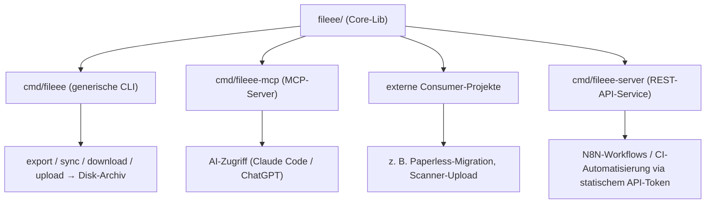

# go-fileee

[](https://github.com/strausmann/go-fileee/actions/workflows/test.yml)
[](https://pkg.go.dev/github.com/strausmann/go-fileee/fileee)
[](https://goreportcard.com/report/github.com/strausmann/go-fileee)
[](go.mod)
[](LICENSE)

Eine **inoffizielle** Go-Client-Library für das **interne** Web-App-API von [Fileee](https://www.fileee.com) (`my.fileee.com`). Fileee bietet kein öffentliches API — diese Library kapselt das Protokoll, das die eigene Web-App verwendet, rekonstruiert aus mitgeschnittenem Netzwerk-Traffic eines eingeloggten eigenen Kontos.

> **Status:** In Entwicklung — privat. Noch keine stabile Version, kein `v0`-Tag, API kann sich jederzeit ändern.

## Über Fileee

[Fileee](https://www.fileee.com) ist ein Dokumentenmanagement-Dienst der fileee GmbH (Deutschland),
der Papierkram digitalisiert und automatisch ordnet. Belege werden per App gescannt oder importiert;
eine Texterkennung (OCR) erkennt Dokumenttyp, Absender, Datum und Fristen automatisch, sodass sich
alles per Volltext durchsuchen lässt. Dazu kommen Fristen-Erinnerungen, Teilen über „fileee Spaces"
(inkl. Bearbeitungsschutz) sowie Export- und Direkt-Integrationen (u. a. DATEV, lexoffice, SevDesk).

Datenschutz ist ein Kernversprechen: **Hosting in Deutschland, DSGVO-konform**, Dokumente werden
**individuell verschlüsselt** gespeichert, Zwei-Faktor-Authentifizierung ist verfügbar.

Ergänzt wird der Dienst durch die **fileeeBox** — eine physische Ablagebox mit individuellem
Barcode: Dokumente werden gescannt und einfach oben in die Box gelegt; die App merkt sich Box und
Position. Über die Box eingescannte Seiten (bis zu 600) belasten das monatliche Upload-Kontingent
nicht. Als günstige Selbstbau-Variante gibt es **fileeeDIY** (Druckvorlagen für Schuhkarton/Ordner).

*Diese Library ist ein inoffizielles, unabhängiges Community-Projekt und steht in keiner Verbindung
zur fileee GmbH.*

## Installation

```bash
go get github.com/strausmann/go-fileee/fileee
```

Voraussetzung: Go 1.23 oder neuer.

## Quickstart

```go
package main

import (
	"context"
	"fmt"
	"log"
	"os"

	"github.com/strausmann/go-fileee/fileee"
)

func main() {
	// Credentials aus einer Secret-Quelle laden, nie hartkodieren.
	client, err := fileee.New(fileee.Credentials{
		Username: os.Getenv("FILEEE_USERNAME"),
		Password: os.Getenv("FILEEE_PASSWORD"),
		TOTPSeed: os.Getenv("FILEEE_TOTP_SEED"), // Base32-Seed, falls Zwei-Faktor aktiv ist
	})
	if err != nil {
		log.Fatal(err)
	}

	ctx := context.Background()
	if err := client.EnsureSession(ctx); err != nil {
		log.Fatal(err)
	}

	// Volltextsuche -> Dokument-IDs, dann Details laden.
	res, err := client.Documents.Search(ctx, "Rechnung", fileee.SearchOptions{Limit: 20})
	if err != nil {
		log.Fatal(err)
	}
	for _, id := range res.IDs {
		doc, err := client.Documents.Get(ctx, id)
		if err != nil {
			log.Fatal(err)
		}
		fmt.Println(doc.ID)
	}
}
```

Credentials gehören nicht in den Quellcode — aus einer Secret-Quelle (Umgebungsvariable, Vault,
Keyring) laden. Weitere Konfiguration über die `With…`-Optionen von `New` (Rate-Limit, eigener
`*http.Client`, Session-Store, User-Agent). Vollständige Referenz aller Typen und Methoden:
[pkg.go.dev](https://pkg.go.dev/github.com/strausmann/go-fileee/fileee) bzw. `go doc ./fileee`.

## Funktionsumfang

Was die Library aktuell abdeckt und was (noch) nicht. Das Fileee-API ist reverse-engineered; nicht
abgedeckte Punkte sind teils bewusst ausgelassen (Risiko), teils schlicht noch nicht implementiert.

**Abgedeckt**

| Bereich | Methoden |
|---|---|
| Auth/Session | `Login`, `Logout` (serverseitiger Widerruf + Jar-Clear), `EnsureSession`, automatische Re-Auth, TOTP-2FA, `AccountStatus` |
| Dokumente | `Documents.Query` / `Diff` / `Get` / `Update` / `Upload`, `Search` (Volltext), `DownloadPDF`, `DownloadPageImage` |
| Export | `Documents.ExportZIP` / `ExportAll` (passwortgeschütztes ZIP als Prozess), `Processes.Get` (Fortschritt), `WaitForProcess` (pollt bis terminal) |
| Teilen | `Documents.Share` (Freigabe-Link) / `Unshare` |
| Share-Link nutzen (anonym) | `NewShareClient` → `Resolve(token)` (typisierte `SharedDocument` mit `PageIDs`), `DownloadPageImage` (Seitenbild), `DownloadSharedPage` (Seiten-OCR), `DownloadSharedPDF` (Voll-PDF vom Static-Host) — ohne Login, für N8N-Webhook-Flows; `ShareTokenFromLink` |
| Dokumenttyp-Felder | `DocumentTypeSchemes` (`Query`/`Diff`/`Get`, `Fields()` je Typ) |
| OCR-Daten | `Documents.PageOCR` (eigenes Login) / `ShareClient.SharedPageOCR` (anonym) → `[]OCRToken` (Text + Bounding-Box) — für Migrationen (z. B. Paperless-ngx) |
| Link-Erkennung | `ParseDocumentLink` erkennt intern (`…/documents/:id`) vs. anonym (`…/shared/:token`) |
| Fehler-Erkennung | `errors.Is(err, ErrRateLimited \| ErrUnsupportedFileType \| ErrNotFound \| ErrDuplicateDocument)`, `BlockedError` (secondsBlocked) |
| FileeeBoxen | `Boxes.List` / `Get` / `AddDocument` / `RemoveDocument` |
| Erinnerungen | `Reminders.Query` / `Diff` / `Get` / `Create` |
| Kontakte | `Contacts.Query` / `Diff` / `Get` / `Create` / `Update` |
| Stammdaten (read) | `Tags`, `Companies`, `DocumentTypes` (`Query` / `Diff` / `Get`) |
| Betrieb | Rate-Limiting, Backoff, Session-Persistenz, konfigurierbarer User-Agent |

**Nicht abgedeckt (bewusst ausgelassen)**

| Funktion | Grund |
|---|---|
| `revision-lock` (Aufbewahrungssperre) | Kann ein Dokument serverseitig unbrauchbar machen (bei Tests beobachtet) — zu riskant für einen Client, bis das Verhalten geklärt ist |
| Hartes Löschen von Dokumenten/Kontakten | Destruktiv; nicht Teil des aktuellen Scopes |

**Noch nicht implementiert (geplant/denkbar)**

| Funktion | API |
|---|---|
| Teilen an einen Kontakt + Dokument-Chat (Konversation) | Endpunkte gemappt, noch nicht in der Lib: `POST /api/conversations/rest/diff` (Liste), `PUT /api/conversations/rest/:id` (anlegen), `.../participants/add\|remove`, `.../rest/:id/message` (Chat), `conversations/invitations/:id/accept` (Annahme) |
| Aktive Shares eines Dokuments auflisten | benötigt „Teilen"-Panel-HAR (Link-Freigaben + Konversationen pro Dokument) |
| „Alle Dateien" ZIP-Datei abholen | Export-Start + Warten bis fertig (`WaitForProcess`) abgedeckt; der finale ZIP-**Byte-Download** noch offen — der Feldname der Download-URL im fertigen `DownloadAllProcess` ist noch nicht verifiziert (finaler Prozess-Snapshot fehlt), wird daher bewusst nicht geraten |
| Erneut analysieren | `POST /api/documents/rest/:id/reanalyze` |
| Papierkorb-Flow | `deleted-documents/list`, `delete-permanently` |
| Seiten-Operationen | Merge/Split/Rotate/Extract/Reorder |
| Tags anlegen/zuweisen, OCR-Text, Live-Push (SSE) | diverse |

> Details zu den Endpunkten: [`docs/API.md`](docs/API.md). Die vollständige Methoden-Referenz steht auf
> [pkg.go.dev](https://pkg.go.dev/github.com/strausmann/go-fileee/fileee).

## Warum

`go-fileee` ist ein **neutraler, allgemeiner** Go-Client für das Fileee-API: er kapselt Login (inkl. TOTP-2FA), Dokument-Sync, Download und Upload programmatisch — ohne Bindung an ein bestimmtes Ziel- oder Fremdsystem. Damit lässt sich Fileee für viele Zwecke automatisieren:

- **Export** von Dokumenten und Stammdaten (Tags, Firmen, Kontakte, Dokumenttypen),
- **Backup/Archivierung** in ein dauerhaftes Disk-Archiv,
- allgemeine **Automatisierung** rund um Fileee-Inhalte,
- **MCP-/AI-Zugriff** auf die eigenen Dokumente,
- **Scanner-Upload** neuer Dokumente nach Fileee,
- **Migration zu einem beliebigen DMS** (z. B. Paperless-ngx) — als **externes** Consumer-Projekt.

> Domänen-/zielsystem-spezifische Integrationen (z. B. eine Paperless-Migration) leben in separaten Consumer-Projekten, die go-fileee importieren. Dieses Repo bleibt bewusst **domänen-neutral** (siehe [ADR-0006](docs/adr/0006-domaenen-neutralitaet.md)).

## Komponenten



| Komponente | Zweck |
|-------|-------|
| **Core-Lib** (`fileee/`) | Auth (Session-Cookie + TOTP), Entities, Download, Upload. Zustandslos — der Aufrufer hält den Sync-Cursor. Kein Ziel-/Fremdsystem-Wissen. |
| **CLI** (`cmd/fileee`) | **Generische** CLI: `export` / `sync` / `download` / `upload` in ein dauerhaftes Disk-Archiv. Kein DMS-/zielsystem-spezifischer Code. |
| **MCP-Server** (`cmd/fileee-mcp`) | Stellt Fileee-Inhalte für AI-Tools (Claude Code, ChatGPT, …) bereit. Da es sich um private Finanzdokumente handelt: **read-only als Default**, Transport/Auth bewusst gewählt. |
| **REST-API-Service** (`cmd/fileee-server`) | Selbst gehosteter HTTP-Wrapper hinter einem statischen API-Token, gedacht für N8N/CI ohne direkten Fileee-Login. Details siehe [Abschnitt „fileee-server"](#fileee-server) unten. |
| **Externe Consumer** | Importieren die Core-Lib als Go-Modul — z. B. eine Paperless-Migration oder ein Scanner-Projekt. Nicht Teil dieses Repos. |

## Geplante Modulstruktur

```
go-fileee/
├── fileee/              # Core-Lib: Auth, Entities, Client (domänen-neutral)
│   ├── auth.go          # Session-Cookie-Login + TOTP
│   ├── documents.go      # Dokumente: query/diff/get/put/upload
│   ├── companies.go      # Firmen
│   ├── contacts.go        # Kontakte (CRUD)
│   ├── tags.go            # Tags
│   ├── documenttypes.go   # Dokumenttypen
│   └── client.go          # HTTP-Client, Cookie-Jar, CSRF-Handling
├── cmd/
│   ├── fileee/            # generische CLI: export / sync / download / upload
│   ├── fileee-mcp/        # MCP-Server für AI-Zugriff
│   └── fileee-server/      # REST-API-Service (Huma/OpenAPI 3.1), siehe Abschnitt „fileee-server"
├── deploy/                # Compose-Referenz-Templates + Dockerfile für fileee-server
├── docs/
│   ├── API.md              # Fileee-API-Referenz (secret-safe, aus HAR rekonstruiert)
│   └── adr/                # Architecture Decision Records
└── fixtures/               # HAR-abgeleitete Test-Fixtures (keine echten Secrets)
```

> Kein `internal/paperless` oder anderes zielsystem-spezifisches Paket — solche Integrationen sind externe Consumer-Projekte (siehe [ADR-0006](docs/adr/0006-domaenen-neutralitaet.md)).

## fileee-server

`cmd/fileee-server` ist ein selbst gehosteter REST-API-Service, der die Core-Lib hinter einem
statischen API-Token exponiert — gedacht für **N8N-Workflows und CI-Automatisierung**, die Fileee
ansprechen sollen, ohne selbst einen Fileee-Login (Username/Passwort/TOTP) zu kennen. Anders als
die Core-Lib (Abschnitt oben), deren Methoden sich jederzeit mit dem internen Fileee-API ändern
können, ist die vom Server exponierte `/v1/...`-Oberfläche **stabil und OpenAPI-3.1-dokumentiert**
(siehe [`docs/API.md`](docs/API.md) Abgrenzung Library vs. Server). Architektur-Hintergrund:
[ADR-0007](docs/adr/0007-ausschluss-destruktiver-operationen.md) (Destruktiv-Gate) und
[ADR-0008](docs/adr/0008-fileee-server.md) (Server-Design).

### Quickstart

```bash
# Einmalig: Session-Volume für den nonroot-User des Containers vorbereiten (uid 65532,
# distroless-Image ohne Shell — siehe Kommentar in deploy/compose.plain.yaml).
sudo mkdir -p <host-pfad-fuer-session> && sudo chown 65532:65532 <host-pfad-fuer-session>

# .env / Compose-Platzhalter ("CHANGE_ME") mit echten Werten befüllen, dann:
docker compose -f deploy/compose.plain.yaml up
```

`deploy/compose.plain.yaml` ist ein **Referenz-Template** (echtes GitOps-Deployment folgt in
`infrastructure/docker/fileee-server`, siehe `.claude/rules/infrastructure-as-code-governance.md`
im homelab-management-Repo). Zwei Konfigurationsmodi stehen zur Wahl:

- **ENV-Modus** (`SECRET_BACKEND=env`, Default): alle Werte — inklusive Secrets — kommen direkt aus
  den unten dokumentierten `FILEEE_*`-Umgebungsvariablen.
- **Infisical-Dual-Mode** (`SECRET_BACKEND=infisical`): die Binary mintet beim Start selbst ein
  Infisical-Token (`infisical login --method=universal-auth`), exportiert die Secrets
  (`infisical export --format=dotenv`), merged sie in die Prozessumgebung und ersetzt sich per
  `syscall.Exec` durch sich selbst (`fileee-server` wird dabei PID 1 — Signal-Forwarding ist damit
  gegenstandslos). In diesem Modus entfallen die `FILEEE_USERNAME`/`FILEEE_PASSWORD`/
  `FILEEE_API_TOKEN`/`FILEEE_TOTP_SEED`-ENV-Variablen; sie werden stattdessen aus Infisical
  bezogen. Beispiel-Umschaltung: siehe auskommentierten Block in `deploy/compose.plain.yaml`.

Drei Compose-Referenz-Templates liegen unter [`deploy/`](deploy/):

| Datei | Szenario |
|---|---|
| `deploy/compose.plain.yaml` | Ohne Reverse Proxy — direkt per Port oder im internen Docker-Netz erreichbar. |
| `deploy/compose.pangolin.yaml` | Öffentlich über Pangolin, **bewusst ohne SSO** (reiner Maschinen-Endpunkt, kein Browser-UI). |
| `deploy/compose.traefik.yaml` | Hinter Traefik als Reverse Proxy. |

### Konfiguration (Umgebungsvariablen)

Alle Werte werden ausschließlich über `LoadConfig` (`cmd/fileee-server/config.go`) gelesen — kein
Feld wird an anderer Stelle direkt aus `os.Getenv` bezogen.

| Variable | Zweck | Default | Pflicht | Secret |
|---|---|---|---|---|
| `FILEEE_USERNAME` | Fileee-Login-Benutzername | – | Ja | Ja |
| `FILEEE_PASSWORD` | Fileee-Login-Passwort | – | Ja | Ja |
| `FILEEE_TOTP_SEED` | Base32-TOTP-Seed für Zwei-Faktor-Konten | leer | Nein (nur bei 2FA-Konten) | Ja |
| `FILEEE_API_TOKEN` | Statisches Bearer-Token, mit dem sich Clients gegen den Server authentifizieren (`X-API-Key`- oder `Bearer`-Header) | – | Ja | Ja |
| `FILEEE_ALLOW_DESTRUCTIVE` | Schaltet die drei Hard-DELETE-Routen frei (siehe Destruktiv-Gate unten) | `false` | Nein | Nein |
| `FILEEE_LISTEN_ADDR` | Adresse, auf der der HTTP-Server lauscht | `:8080` | Nein | Nein |
| `FILEEE_SESSION_PATH` | Pfad, unter dem die Fileee-Session persistiert wird | `/home/nonroot/session.json` | Nein | Nein (Dateiinhalt ist sensibel, Rechte `0600`) |
| `FILEEE_KEEPALIVE_INTERVAL` | Intervall des Session-Keepalive | `15m` | Nein | Nein |
| `FILEEE_WAIT_TIMEOUT` | Default-Wartezeit von `POST /v1/processes/{id}/wait`, falls kein `?timeout=` mitgeschickt wird | `60s` | Nein | Nein |
| `FILEEE_WAIT_MAX` | Obergrenze, auf die jedes angeforderte Wait-Timeout gedeckelt wird | `300s` | Nein | Nein |
| `FILEEE_RATE_RPS` | Erlaubte Request-Rate/Sekunde gegen die Fileee-API | `1` | Nein | Nein |
| `FILEEE_RATE_BURST` | Burst-Größe des Token-Buckets | `3` | Nein | Nein |
| `FILEEE_TRUSTED_PROXIES` | Kommagetrennte IPs/CIDRs vertrauenswürdiger Reverse-Proxies (Access-Log/Client-IP-Ermittlung) | leer | Nein | Nein |
| `FILEEE_CLIENT_IP_HEADERS` | Kommagetrennte Header-Prüfreihenfolge zur Client-IP-Ermittlung | `CF-Connecting-IP,X-Real-IP,X-Forwarded-For` | Nein | Nein |
| `FILEEE_DOCS_PUBLIC` | Ob `/docs` (Doku-UI) ohne API-Token erreichbar ist | `true` | Nein | Nein |
| `FILEEE_MAX_UPLOAD_SIZE` | Max. Body-Größe von `POST /v1/documents` in Bytes | `33554432` (32 MiB) | Nein | Nein |
| `FILEEE_WEBHOOK_URL` | Ziel-URL für ausgehende Webhook-Benachrichtigungen | leer (Webhooks deaktiviert) | Nein | Nein |
| `FILEEE_WEBHOOK_SECRET` | Signiert ausgehende Webhook-Payloads | leer | Nein | Ja |
| `FILEEE_WATCH_INTERVAL` | Polling-Intervall des Änderungs-Watchers | `0` (Watcher deaktiviert) | Nein | Nein |
| `FILEEE_USER_AGENT` | Überschreibt den User-Agent gegen Fileee | leer (Core-Lib-Default) | Nein | Nein |
| `FILEEE_LOG_LEVEL` | Log-Level des strukturierten Loggers (`slog`) | `info` | Nein | Nein |

**Secret-Backend / Infisical-Dual-Mode** (`cmd/fileee-server/secrets.go`, optional — nur relevant, wenn `SECRET_BACKEND=infisical` gesetzt ist oder eine Universal-Auth-Client-ID vorliegt):

| Variable | Zweck | Default | Pflicht (im Infisical-Modus) | Secret |
|---|---|---|---|---|
| `SECRET_BACKEND` | `env` (Default) oder `infisical` | `env` | Nein | Nein |
| `INFISICAL_UNIVERSAL_AUTH_CLIENT_ID` | Machine-Identity Client-ID | – | Ja | Ja |
| `INFISICAL_UNIVERSAL_AUTH_CLIENT_SECRET` | Machine-Identity Client-Secret | – | Ja | Ja |
| `INFISICAL_DOMAIN` | Self-hosted Infisical-URL, **mit** `/api` (z. B. `https://secretsmanager.strausmann.cloud/api`) | – | Ja | Nein |
| `INFISICAL_PROJECT_ID` | Ziel-Projekt-ID | – | Ja | Nein |
| `INFISICAL_ENV` | Ziel-Environment (`dev`/`staging`/`prod`) | – | Ja (CLI-Default wäre sonst `dev` — für `prod` fatal, siehe `.claude/rules/secret-environment-awareness.md` im homelab-management-Repo) | Nein |
| `INFISICAL_PATH` | Secret-Pfad/Folder innerhalb des Projekts | `/` | Nein | Nein |

### Endpunkt-Übersicht

Alle Routen liegen unter `/v1/...` (Ausnahme `/healthz`). Vollständige, maschinenlesbare
Beschreibung: OpenAPI 3.1 unter `/openapi.json`/`/openapi.yaml`, interaktive Docs unter `/docs`
(`FILEEE_DOCS_PUBLIC` steuert, ob `/docs` ohne Token erreichbar ist).

| Gruppe | Routen |
|---|---|
| **Dokumente/Seiten** (Read, PDF-/Bild-Streams, OCR) | `GET /v1/documents` (Liste/Volltextsuche), `GET /v1/documents/{id}`, `GET /v1/documents/{id}/pdf`, `GET /v1/pages/{pageId}/image`, `GET /v1/pages/{pageId}/ocr` |
| **Stammdaten** (Tags/Companies/Contacts/Document-Types/Schemes/Reminders/Boxes) | `GET /v1/tags`, `GET /v1/companies`, `GET /v1/contacts`, `GET /v1/document-types`, `GET /v1/document-type-schemes`, `GET /v1/reminders`, `GET /v1/boxes`, `GET /v1/boxes/{id}` |
| **Write** (Upload/Update/Share/Unshare/Box/Reminders/Contacts/Export-ZIP/Processes/Wait) | `POST /v1/documents` (Upload, multipart), `PUT /v1/documents/{id}`, `POST /v1/share`, `POST /v1/documents/{id}/unshare`, `POST` bzw. `DELETE /v1/boxes/{boxId}/documents/{docId}` (Einheften/Aushängen, kein Destruktiv-Gate), `POST /v1/reminders`, `PUT /v1/reminders/{id}`, `POST /v1/contacts`, `PUT /v1/contacts/{id}`, `POST /v1/documents/export-zip`, `GET /v1/processes/{id}` (Poll), `POST /v1/processes/{id}/wait` (blockierend, auf `FILEEE_WAIT_MAX` gedeckelt) |
| **Share-Proxy** (anonym, ohne Fileee-Login, `/v1/share-objects/...`) | `POST /v1/share-objects/{token}` (auflösen), `GET /v1/share-objects/{token}/pages/{pageId}/image`, `GET /v1/share-objects/{token}/pages/{pageId}/ocr`, `GET /v1/share-objects/{token}/documents/{docId}/pdf` |
| **Resolver** (ein Link rein, ein einheitliches Dokument raus) | `POST /v1/resolve {url}` — erkennt intern vs. anonym per `?include=ocr` |
| **Konversationen** (Chat, Teilnehmer, Einladungen) | `GET /v1/conversations`, `GET /v1/conversations/{id}`, `GET /v1/documents/{id}/conversations`, `POST /v1/conversations/{id}/messages`, `POST`/`DELETE /v1/conversations/{id}/documents/{docId}` (kein Destruktiv-Gate), `POST /v1/conversations/{id}/participants`, `DELETE /v1/conversations/{id}/participants/{participantId}`, `GET /v1/conversations/invitations`, `POST /v1/conversations/invitations/accept/{token}` (Annahme-Pfad bewusst `.../accept/{token}`, nicht `.../{token}/accept` — vermeidet einen Go-`ServeMux`-Pattern-Konflikt mit der Dokument-Teilen-Route) |
| **Destruktiv (Hard-DELETE)** | `DELETE /v1/documents/{id}`, `DELETE /v1/contacts/{id}`, `DELETE /v1/reminders/{id}` |
| **Sonstiges** | `GET /healthz` (Liveness, kein Auth nötig, kein Fileee-Roundtrip) |

**Destruktiv-Gate:** Die drei Hard-DELETE-Routen (`DELETE /v1/documents/{id}`,
`DELETE /v1/contacts/{id}`, `DELETE /v1/reminders/{id}`) werden nur registriert, wenn
`FILEEE_ALLOW_DESTRUCTIVE=true` gesetzt ist. Bleibt das Flag `false`, ist der DELETE-Pfad dem
Server für das DELETE-Verb komplett unbekannt — da GET/PUT auf denselben Pfaden weiterhin
registriert sind, antwortet der Server dann mit **405 Method Not Allowed** statt 404. Jede
tatsächlich ausgeführte Destruktiv-Operation wird zusätzlich vor dem Löschversuch als
Audit-Log-Zeile protokolliert. Das Aushängen aus einer Box (`DELETE /v1/boxes/{boxId}/documents/{docId}`)
und das Entfernen aus einer Konversation (`DELETE /v1/conversations/{id}/documents/{docId}`) fallen
**nicht** unter dieses Gate — beides löscht kein Dokument, sondern nimmt nur eine Zuordnung zurück.

### Auth

Jeder Request (außer `/healthz`, `/openapi.json`, `/openapi.yaml` sowie `/docs` bei
`FILEEE_DOCS_PUBLIC=true`) braucht das statische `FILEEE_API_TOKEN` als `X-API-Key`- oder
`Bearer`-Header. Details zum Betrieb hinter Pangolin (bewusst ohne SSO) siehe
`deploy/compose.pangolin.yaml`.

## Auth-Modell (Kurzfassung)

Fileee hat **kein** Bearer-/Refresh-Token-API. Die Session lebt in einem httpOnly-Cookie plus CSRF-Header (`x-xsrf-token`, Double-Submit-Cookie). 2FA läuft über TOTP und wird **im selben Login-Request** mitgeschickt — dadurch ist ein vollständig headless-Betrieb möglich, solange der TOTP-Seed bekannt ist.

```
GET  /api/f/start                        → Session/CSRF-Cookie initialisieren
POST /api/f/existent   {username}        → Konto- + 2FA-Check
POST /api/f/login      {user,pw,totp}    → setzt Session-Cookie
GET  /api/f/user-session                 → authorized:true zur Kontrolle
```

Details: [`docs/API.md`](docs/API.md) Abschnitt 2, sowie [ADR-0002](docs/adr/0002-auth-modell-session-cookie-totp.md).

## Sicherheit

- **Credentials** (Username, Passwort, TOTP-Seed) gehören **ausschließlich** in einen Secret-Manager (Vaultwarden/Infisical) — niemals in Code, Fixtures oder Commits.
- Die **Session-Cookie-Jar** ist ein Secret (Dateirechte `0600`), wird nie geloggt oder committed.
- Dokument-Inhalte und -Metadaten sind **PII** — Test-Fixtures enthalten ausschließlich synthetische oder bewusst anonymisierte Daten.
- Die Library **schont Fileees Infrastruktur bewusst**: ein eingebauter Rate-Limiter (konservativer Default) plus Exponential-Backoff mit Jitter im HTTP-Transport begrenzen die Request-Frequenz für alle Konsumenten, Delta-Sync (`/diff`) statt Voll-Reloads reduziert die Last, und Konto-Sperren (`secondsBlocked`) werden respektiert. Details: [ADR-0005](docs/adr/0005-schonender-betrieb-rate-limiting.md).
- Siehe [`docs/API.md`](docs/API.md) Abschnitt 6 für die vollständigen Secret-Hinweise.

## Disclaimer

Dies ist **kein offizielles Fileee-API** — es handelt sich um eine Rekonstruktion des internen Protokolls der Web-App `my.fileee.com`, gewonnen aus dem Netzwerkverkehr eines eigenen, eingeloggten Kontos. Konsequenzen:

- Fileee kann das interne API **jederzeit ohne Ankündigung ändern** — diese Library kann dadurch brechen.
- Die Nutzung ist **ausschließlich für das eigene Fileee-Konto** vorgesehen, nicht für fremde Konten oder Massenzugriffe.
- Es gibt **keine Gewähr** für Vollständigkeit, Korrektheit oder Dauerhaftigkeit der Funktionalität.
- Nutzer sind selbst dafür verantwortlich, die Nutzungsbedingungen von Fileee einzuhalten.

## Dokumentation

- [`docs/API.md`](docs/API.md) — vollständige API-Referenz (Endpunkte, Auth-Ablauf, Datenmodell; das enthaltene Paperless-Mapping ist ein Beispiel für externe Consumer, nicht Teil der Lib)
- [`docs/adr/`](docs/adr/) — Architecture Decision Records (Grundsatzentscheidungen zu Architektur, Auth, Risiko, Tests)

## Lizenz

[MIT](LICENSE) — Copyright © 2026 Björn Strausmann
